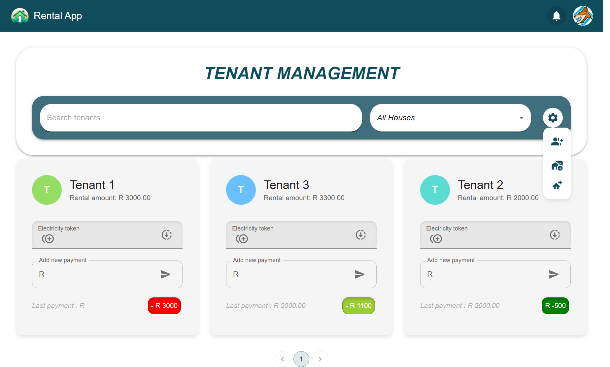

# Rental-App

Rental-App is a web application designed for property owners to efficiently track their expenses and rental income. Users can manage their tenants, add payments, and request electricity for tenants, all from a single platform.

## Features

- **Expense Tracking:** Keep track of all rental-related expenses.
- **Income Tracking:** Monitor rental income from tenants.
- **Tenant Management:** View and manage all tenants in one place.
- **Payment Management:** Add and track payments made by tenants.
- **Electricity Requests:** Request electricity for tenants easily.

## Screenshots

1. **Expense Dashboard**

   

2. **Tenant Management Dashboard**

   

## Installation

# .env file
VITE_CLERK_PUBLISHABLE_KEY=your_publishable_key_here
VITE_DB_URL=postgresql://your_db_url_here


1. Clone the repository:
   ```bash
   git clone https://github.com/TheNumbered/rental-app.git

2. Navigate to the project directory:
    ```bash
    cd rental-app

3. Install dependencies:
    ```bash
    npm install
4. Start the application:
    ```bash
    npm run dev

